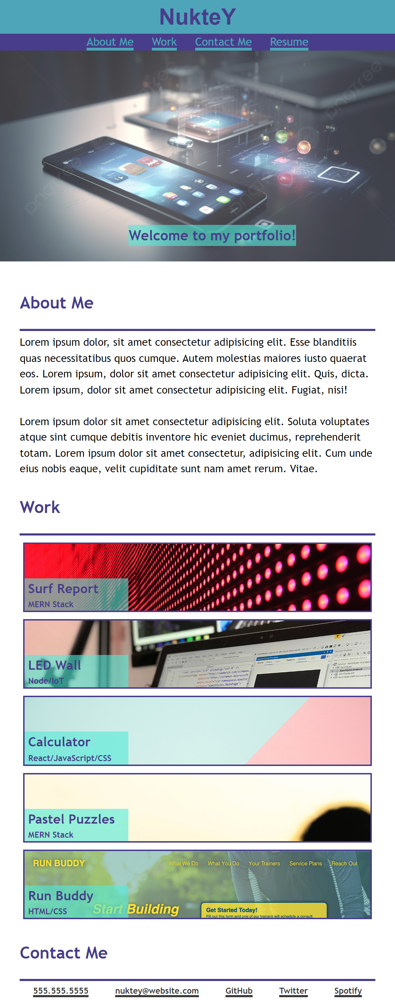

# Front-End Works

A dynamic portfolio display presenting my works.

## Description

At the top of the page, you'll discover a refined navigation bar crafted with CSS. It smoothly scrolls as you navigate, elegantly changing color upon link hover for a seamless browsing experience.

At the work-section, each image enlarges slightly when you hover over it with the cursor.

In addition to desktop viewing, my webpage features a responsive layout that seamlessly adapts to various screen sizes, accommodating both max-widths of 1000px and 600px.

Here is the link for my page:
[NukteY//Web Developer](https://nukte-y.github.io/portfolio/).

## Installation
N/A

## Usage

Explore different screen size views here:

  

  
  
  

**Note**: This is an initial version, and I plan to add more as I make progress.

## Credits
N/A

## License
Please refer to the LICENSE in the repo.
